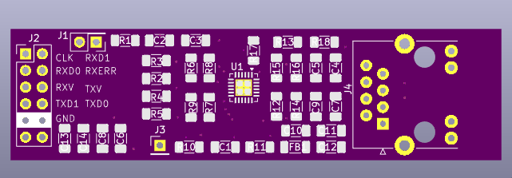
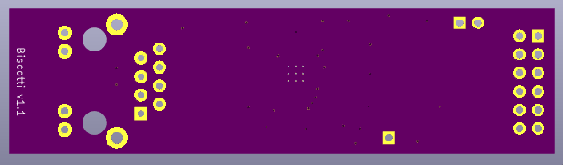

# PCBs for Coffee-Shop project

## Biscotti 

x1 Ethernet Pmod for full-duplex 100BASE-TX over RMII using the LAN8720A chip. 

## AI Policy 

No AI was used by me in the development of this hardware. 

All code and design decisions are, and will remain, entirely human made. 

## License 

Copyright Julia Desmazes, 2026 

This hardware is distributed under the **strongly** reciprocal CERN Open Hardware Licence Version 2 unless
otherwise specified.
